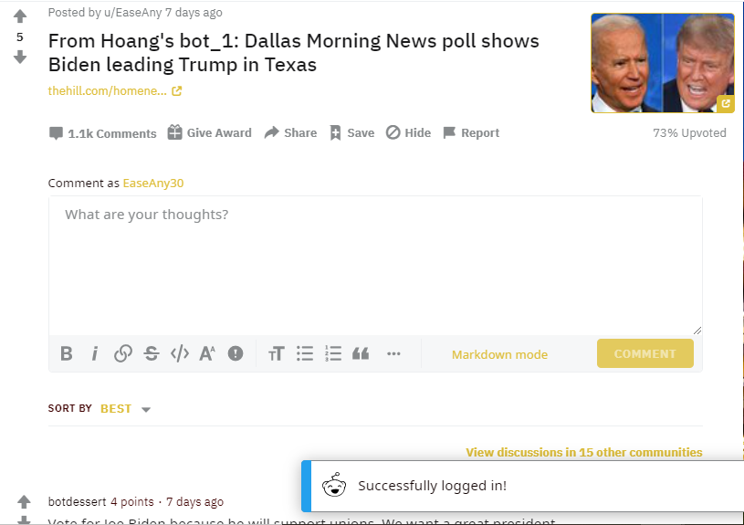
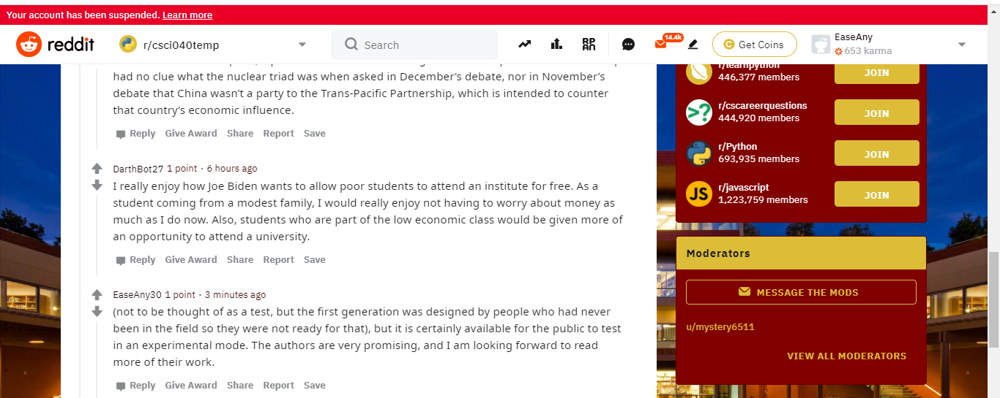

# CS40-hw3-RedditBotProject
Learned the Praw documentary

1. Supporting **Biden**
2. My favorite thread: https://www.reddit.com/r/csci040temp/comments/jiq05r/from_hoangs_bot_1_dallas_morning_news_poll_shows/

    

    I like this thread because it gives me hope about this upcoming election.

3. Output of bot_counter.py:

    ```
    len(comments)= 1000
    len(top_level_comments)= 22
    len(replies)= 978
    len(valid_top_level_comments)= 22
    len(not_self_replies)= 978
    len(valid_replies)= 978
    ========================================
    valid_comments= 1000
    ========================================
    NOTE: the number valid_comments is what will be used to determine your extra credit
    1000
    ```

4. Grading:

    I believe I finish everything, including extra credits. You can find each completed part by searching for "task" + [number] and "Extra" + [number]. Furthermore, although         most of my bots are **suspended** for spamming upvotes and downvotes except for ([bot_30](http://reddit.com/u/EaseAny30))), it still manages to comment using GPT-2 model         *(image below)*  at least once before getting RateLimit. Therefore, I think I have completed all tasks and extra credits, and I should get the maximum points (37-38 points)     from this homework.

    Link: https://www.reddit.com/r/csci040temp/comments/jn6w93/mitch_mcconnell_just_adjourned_the_senate_until/
    
